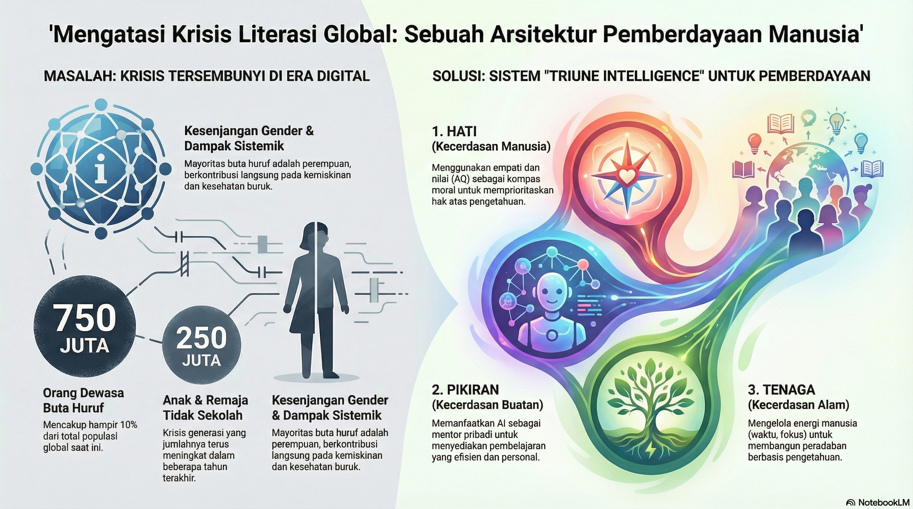

# UAS-1 My Concepts: Arsitektur Literasi Digital untuk Pemberdayaan Manusia

---

## Fenomena: Krisis Literasi di Era Kelimpahan Informasi

Pada tahun 2025, populasi dunia diperkirakan mencapai sekitar 8,2 miliar jiwa. Namun, di tengah kemajuan teknologi yang begitu pesat, kita menghadapi sebuah realitas yang kontras: akses pendidikan dan melek huruf masih menjadi masalah global yang sangat signifikan. Pendidikan bukan sekadar proses belajar di kelas, melainkan hak fundamental dan kunci utama bagi perbaikan ekonomi serta sosial.

Fenomena yang kita hadapi saat ini adalah jurang pengetahuan yang lebar:

- **Analfabetisme Global:** 
  Sekitar 750 juta orang dewasa di seluruh dunia tidak dapat membaca atau menulis, yang mencakup hampir 10% dari total populasi global.
- **Kesenjangan Gender:**
  Mayoritas dari penduduk yang buta huruf ini adalah perempuan, yang menunjukkan adanya diskriminasi akses pendidikan yang masih mengakar.
- **Krisis Generasi:**
  Hampir 250 juta anak dan remaja (usia 6–18 tahun) tidak bersekolah pada tahun 2024, sebuah angka yang menunjukkan tantangan besar bagi pembangunan manusia.
- **Dampak Sistemik:**
  Rendahnya tingkat pendidikan berkontribusi langsung pada kemiskinan, kesehatan yang buruk, dan rendahnya keterlibatan dalam proses pengambilan keputusan.

---

## My Masterpiece: Sistem Sosio-Teknis (TISE) untuk Pendidikan

Konsep **"Mahakarya Rekayasa"** saya adalah sebuah **Sistem Sosio-Teknis (TISE)** yang dirancang untuk pemberdayaan kolektif 8,2 miliar manusia. Mahakarya ini bukan sekadar alat teknis, melainkan arsitektur yang menyelaraskan **Triune Intelligence** untuk mengubah **750 juta orang** yang "tak bersuara" menjadi penggerak peradaban.

### Hati (Kecerdasan Manusia / Homocordium)
Komponen pertama adalah **Axiological Intelligence (AQ)** atau Kecerdasan Nilai. "Hati" adalah kompas moral yang menjawab mengapa masalah literasi ini adalah masalah yang paling layak untuk kita selesaikan.

- **Empati sebagai Penggerak**: Tanpa "hati" yang selaras, teknologi pendidikan hanya akan menjadi optimasi tanpa jiwa. Kita harus memahami bahwa buta huruf adalah penghambat martabat manusia.
- **Komunikasi Interpersonal dan Publik**: Kunci dari pemberdayaan ini terletak pada proses di mana kita menyelaraskan nilai-nilai kemanusiaan untuk memastikan setiap orang mendapatkan haknya atas pengetahuan.
- **Moralitas Akses**: AQ membimbing kita untuk fokus pada wilayah yang paling membutuhkan, seperti Afrika Sub-Sahara di mana tingkat melek huruf dewasa masih di bawah sepertiga populasi di beberapa negara.

### Pikiran (Kecerdasan Buatan / Homodeus)
Komponen kedua adalah **Synergistic Practical Intelligence (PI-A)**, sebuah simbiosis antara akal budi manusia dan *Artificial Intelligence*. Di era ini, AI berfungsi sebagai fasilitator par excellence.

- **Juru Tulis Cerdas**: AI dalam sistem ini berperan sebagai instrumen cerdas yang mampu mengelola data dalam skala masif untuk menyediakan materi pembelajaran yang dipersonalisasi bagi 250 juta anak yang tidak bersekolah.
- **Transformasi Pembelajaran**: PI-A memungkinkan kita untuk menerjemahkan hambatan bahasa dan mengatasi ketiadaan guru fisik di daerah terpencil dengan menyediakan mentor AI yang interaktif dan selalu tersedia.
- **Efisiensi Kognitif**: AI mempercepat proses literasi dasar bagi orang dewasa, membantu mereka mengejar ketertinggalan tingkat melek huruf dunia yang saat ini masih stagnan di angka 86–87%.

### Tenaga (Kecerdasan Alam / Natural Intelligence)
Komponen ketiga adalah penggunaan energi materi atau **Human Energon** (waktu, fokus, dan kreativitas) yang dikelola secara holistik melalui **CORE Engine**.

- **Sistem PSKVE**: Mahakarya ini mengelola tenaga melalui dimensi *Product, Service, Knowledge, Value,* dan *Environmental*.
- **Knowledge as Power**: Fokus pada komponen *Knowledge* bertujuan untuk memutus rantai kemiskinan ekstrem yang membelenggu sekitar 700 juta orang.
- **Keberlanjutan Peradaban**: Dengan meningkatkan literasi, kita meningkatkan produktivitas dan kohesi sosial, yang pada akhirnya akan menyeimbangkan "tenaga" planet dan energi manusia untuk pembangunan berkelanjutan.

---

## Keistimewaan Pengetahuan dan Kebergunaan (Usefulness)

Keistimewaan pengetahuan yang saya tawarkan dalam Mahakarya ini terletak pada kemampuannya untuk mengintegrasikan TI bukan sebagai pengganti guru, melainkan sebagai platform Komunikasi Publik yang masif. Sistem ini memungkinkan 8,2 miliar "Protagonis-Penulis" untuk:

1.  **Menyelaraskan Hati (AQ)** mereka terhadap pentingnya literasi sebagai hak asasi.
2.  **Memperkuat Pikiran (PI-A)** mereka dengan bantuan asisten cerdas untuk belajar kapan saja dan di mana saja.
3.  **Mengelola Tenaga (PSKVE)** secara bijaksana untuk membangun ekonomi yang berbasis pengetahuan, bukan sekadar tenaga fisik.

## Kesimpulan

Penerapan Sistem dan Teknologi Informasi di era AI untuk **Akses Pendidikan dan Melek Huruf** adalah solusi strategis untuk menghadapi tantangan global. Dengan menghapus buta huruf, kita tidak hanya memberikan kemampuan membaca, tetapi memberikan kunci bagi miliaran manusia untuk membuka pintu kesehatan, ekonomi, dan masa depan yang lebih baik.